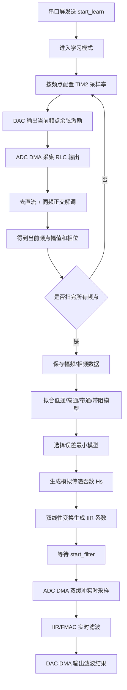
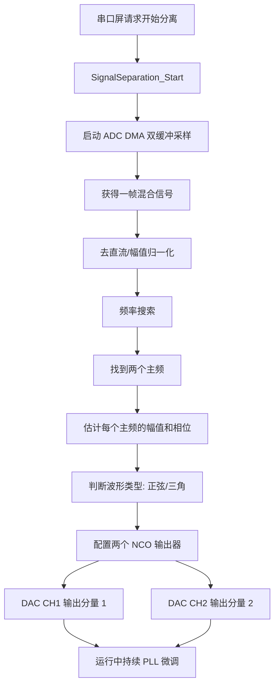

# EDU_Work 工程算法与交互说明

>`本文由GPT写作，有问题可以反馈b站UP：杂粮煎饼大王。`
>或者提交issues

>`2025G文件目录下，有一些文本文件和图片，和一个ipynb是Up在用于调试和整理思路的一些python文件，这些Git的时候一并上传上来，并无用处，主要参考MDK-ARM文件里面的2025G的keil工程，一切以最后的代码工程为准。`
---

## 1. 工程总体结构

仓库中主要包含两个工程：

```text
EDU_Work/
├── 2023H/
│   └── Core/
│       ├── Src/main.c
│       ├── SignalSeparation/
│       │   ├── signal_separation.c
│       │   ├── signal_separation.h
│       │   └── signal_separation_config.h
│       └── SerialScreen/
│           └── serial_screen.*
│
└── 2025G/
    └── Core/
        └── App/
            ├── rlc_app.c / rlc_app.h
            ├── rlc_filter.c / rlc_filter.h
            └── rlc_display.c / rlc_display.h
```

两个工程的核心思想不同：

| 工程 | 主要目标 | 核心算法 | 交互方式 |
|---|---|---|---|
| `2025G` | 学习未知 RLC 网络的频率响应，并用数字滤波器复现 | 扫频测量、幅相分析、RLC 模型拟合、IIR 系数生成、实时滤波 | 串口屏发送 `start_learn` / `start_filter`，调试串口输出拟合结果 |
| `2023H` | 从混合信号中分离两个主要频率分量，并分别输出 | ADC 采样、频率搜索、幅相估计、波形判断、NCO 重建、轻量 PLL 相位校正 | 串口屏请求开始分离、设置相位、显示识别频率 |

---

# 2. 2025G：RLC 系统学习与数字滤波复现

## 2.1 应用层文件分工

`2025G/Core/App` 下的三个文件分别承担三层职责：

```text
rlc_app.c
    ↓ 应用状态机与 HAL 回调转发
rlc_filter.c
    ↓ 扫频、拟合、IIR/FMAC 实时滤波算法
rlc_display.c
    ↓ 串口屏命令解析、曲线显示、调试串口输出
```

### 2.1.1 `rlc_app.c`：顶层状态机

`rlc_app.c` 是 2025G 的应用入口。它不直接实现算法，而是负责在主循环中根据交互命令切换工作模式。

内部状态为：

```c
RLC_APP_STATE_IDLE
RLC_APP_STATE_LEARNING
RLC_APP_STATE_FILTERING
```

主要逻辑：

```text
rlc_app_init()
    ├── rlc_filter_init()
    ├── rlc_display_init()
    └── 输出 CMD_READY,start_learn,start_filter

rlc_app_task()
    ├── 若收到 start_learn
    │       ├── 如果正在实时滤波，先停止实时滤波
    │       ├── 进入 LEARNING
    │       ├── 调用 rlc_filter_start_learning()
    │       └── 学习结束后回到 IDLE
    │
    ├── 若收到 start_filter
    │       ├── 调用 rlc_filter_start_realtime()
    │       └── 若启动成功，进入 FILTERING
    │
    └── 调用 rlc_filter_task()
            └── 处理 ADC DMA 半缓冲/全缓冲产生的实时滤波任务
```

同时，`rlc_app.c` 还统一接管 HAL 回调，例如：

```text
HAL_UART_RxCpltCallback       → rlc_display_uart_rx_cplt_callback
HAL_UART_ErrorCallback        → rlc_display_uart_error_callback
HAL_ADC_ConvHalfCpltCallback  → rlc_filter_adc_conv_half_cplt_callback
HAL_ADC_ConvCpltCallback      → rlc_filter_adc_conv_cplt_callback
HAL_DAC_ConvHalfCpltCallback  → rlc_filter_dac_conv_half_cplt_ch1_callback
HAL_DAC_ConvCpltCallbackCh1   → rlc_filter_dac_conv_cplt_ch1_callback
```

这样做的好处是：

- 中断回调只做“转发/置标志”，不在中断里跑复杂算法；
- 主循环统一处理任务，避免回调和算法耦合太深；
- 显示、算法和状态机边界清晰。

---

## 2.2 2025G 算法流程

2025G 的算法可以分成两个阶段：

1. **学习阶段**：扫频测量 RLC 网络的幅频/相频响应，并拟合模拟系统模型；
2. **实时阶段**：根据拟合结果生成数字 IIR 系数，然后对 ADC 输入实时滤波并输出到 DAC。

整体流程如下：



---

## 2.3 扫频测量逻辑

扫频由 `rlc_filter_start_learning()` 启动，内部调用 `sweep_run_once()` 完成一整轮扫频。

每个频点的处理流程为：

```text
1. 根据目标频率选择本次记录中包含的周期数
2. 根据目标频率、周期数和采样点数反推 TIM2 采样率
3. 生成 DAC 余弦激励表
4. 启动 DAC DMA 输出激励
5. 启动 ADC DMA 采集被测 RLC 输出
6. 等待 ADC DMA 采样完成或超时
7. 对 ADC 数据去直流
8. 用同频 sin/cos 参考信号做正交解调
9. 计算幅值 mag 和相位 phase_deg
10. 保存到 fit_freq_hz[]、fit_mag[]、fit_phase_deg[]
11. 将当前频点幅相发送给屏幕曲线显示
```

这里的核心思想是**单频点锁相检测**，不是直接做 FFT。对于某个频率 `f`，系统输出可以近似写成：

```text
x[n] = A cos(2πfn/Fs + φ) + DC + noise
```

程序先去掉 DC，然后分别与同频的 cos 和 sin 做相关：

```text
re = Σ x[n] cos(2πfn/Fs)
im = Σ x[n] sin(2πfn/Fs)
```

再由 `re` 和 `im` 计算幅值和相位：

```text
mag   ∝ sqrt(re² + im²)
phase = atan2(im, re)
```

这种方法适合本题的原因是：

- 扫频时每次只关心一个确定频点；
- 不需要完整 FFT；
- 对噪声有一定平均作用；
- 频点可控，便于配合 DAC 激励和 ADC 采样。

---

## 2.4 RLC 模型拟合逻辑

扫频结束后，程序会尝试将测得的幅频/相频数据拟合为二阶系统。候选模型包括：

```text
低通  LOWPASS
高通  HIGHPASS
带通  BANDPASS
带阻  BANDSTOP
```

统一的二阶传递函数形式为：

```text
Hs = (n2*s^2 + n1*s + n0) / (s^2 + a*s + b)
```

其中：

```text
w0 = 2πf0
b  = w0²
a  = w0 / Q
```

不同滤波类型主要体现在分子项不同：

| 类型 | 分子形式 | 说明 |
|---|---|---|
| 低通 | `n0 = K*b` | 低频通过，高频衰减 |
| 高通 | `n2 = K` | 高频通过，低频衰减 |
| 带通 | `n1 = K*a` | 谐振频率附近通过 |
| 带阻 | `n2 = K, n0 = K*b` | 谐振频率附近被抑制 |

拟合的主要步骤为：

```text
1. 从扫频结果中提取有效幅值点
2. 遍历或搜索候选 f0、Q、K
3. 对每种模型计算理论幅频响应
4. 与实测幅频响应比较误差
5. 记录误差最小的模型和参数
6. 对相位残差做线性拟合，估计延时 delay 和固定相位偏移 phase0
7. 输出 FIT_SYSTEM 和 FIT_COEFF 调试信息
8. 调用 iir_make_coefficients() 生成数字滤波器系数
```

调试串口会输出类似：

```text
FIT_SYSTEM,type,BANDPASS,K,...,f0_Hz,...,Q,...,delay_us,...,phase0_deg,...,err,...
FIT_COEFF,Hs=(n2*s^2+n1*s+n0)/(s^2+a*s+b),n2,...,n1,...,n0,...,a,...,b,...
IIR_COEFF,b0,...,b1,...,b2,...,a1,...,a2,...
```

这些信息可以直接用于判断拟合是否合理：

- `type` 是否符合实际电路拓扑；
- `f0_Hz` 是否接近理论谐振频率；
- `Q` 是否合理；
- `err` 是否足够小；
- `IIR_COEFF` 是否成功生成。

---

## 2.5 IIR 实时滤波逻辑

当屏幕或串口发送 `start_filter` 后，程序调用 `rlc_filter_start_realtime()`。

实时滤波流程如下：

```text
1. 检查是否已有有效拟合模型
2. 将滤波器类型发送到屏幕显示
3. 根据 Hs 系数生成 IIR 双二阶系数
4. 配置 TIM2 为固定实时采样率
5. 启动 ADC DMA 循环采样
6. 启动 DAC DMA 循环输出
7. ADC 半缓冲/全缓冲中断只置位标志
8. 主循环中的 rlc_filter_task() 读取标志并处理对应半缓冲
9. 将滤波结果写入 DAC 对应半缓冲
```

核心结构是典型的 DMA 双缓冲流水：

```text
ADC DMA 前半缓冲完成中断
    ↓
置位 PROCESS_HALF
    ↓
主循环处理 adc_buf[0 : N/2]
    ↓
写入 dac_buf[0 : N/2]

ADC DMA 后半缓冲完成中断
    ↓
置位 PROCESS_FULL
    ↓
主循环处理 adc_buf[N/2 : N]
    ↓
写入 dac_buf[N/2 : N]
```

这样做的优点是：

- 中断里不做大量计算；
- ADC 采样、CPU 处理、DAC 输出可以形成流水；
- 实时滤波不需要阻塞等待整帧数据；
- 后续可以将软件 IIR 替换成 FMAC 加速。

---

## 2.6 2025G 交互逻辑

### 2.6.1 串口通道分工

2025G 中主要使用两个串口：

| 串口 | 用途 |
|---|---|
| `USART1` | 调试串口，输出状态、拟合参数、IIR 系数，也可接收 `Start_2` 启动滤波 |
| `USART3` | 串口屏通信，接收屏幕命令，发送曲线点和文本显示 |

### 2.6.2 屏幕命令

`rlc_display.c` 按字节匹配屏幕发送的命令：

```text
start_learn   → 请求执行扫频学习
start_filter  → 请求启动实时滤波
```

匹配成功后只置位标志：

```text
start_learn_requested  = 1
start_filter_requested = 1
```

然后由 `rlc_app_task()` 在主循环中读取标志并执行动作。

### 2.6.3 屏幕显示

扫频过程中，程序会把每个有效频点的幅值和相位发给屏幕曲线控件：

```text
add 3,0,value   // 通道 0：幅频曲线
add 3,1,value   // 通道 1：相频曲线
FF FF FF        // Nextion/陶晶驰类屏幕命令结束符
```

显示映射方式：

```text
幅值：线性 mag → 20log10(mag) → 限制在 -40dB ~ 0dB → 映射到 0~127
相位：phase_deg → 规整到 -180° ~ 180° → 映射到 0~127
```

因为屏幕曲线点数有限，程序会将扫频点抽样压缩到最多约 320 点，避免一次性发送过多点导致屏幕刷新异常。

---

# 3. 2023H：混合信号分离与双路重建

## 3.1 应用层文件分工

2023H 工程没有名为 `App` 的文件夹，应用逻辑主要分布在：

```text
Core/Src/main.c
    ↓ 主循环任务调度：屏幕任务、开始分离、相位设置、频率显示

Core/SignalSeparation/signal_separation.c
    ↓ 算法核心：采样、频率识别、波形判断、NCO 重建、PLL 修正

Core/SerialScreen/serial_screen.*
    ↓ 串口屏命令解析和显示输出
```

可以把它理解为：

```text
SerialScreen 负责“人机交互”
main.c       负责“任务调度”
SignalSeparation 负责“信号处理算法”
```

---

## 3.2 主循环交互调度

`main.c` 初始化外设后只初始化了串口屏模块：

```text
SerialScreen_Init()
```

主循环中持续执行：

```text
while (1)
{
    SerialScreen_Task();

    如果屏幕请求设置相位：
        SignalSeparation_SetPhaseOffsetDeg(phase_set_value);

    如果屏幕请求开始分离：
        第一次：SignalSeparation_Start();
        后续：SignalSeparation_RestartIdentify();
        清除 frequencies_sent 标志；

    如果已经启动分离：
        SignalSeparation_Task();

        如果已经识别到两个频率且还没发送给屏幕：
            SerialScreen_SendFrequencies(freq0, freq1);
}
```

这说明 2023H 的主循环采用了“屏幕事件驱动 + 信号处理任务轮询”的方式：

- 屏幕按钮不直接运行算法，只设置请求；
- `main.c` 读取请求后调用算法模块；
- 算法模块识别成功后，`main.c` 再把结果发回屏幕。

---

## 3.3 信号分离算法整体流程

2023H 的目标是：从一路 ADC 输入的混合周期信号中，找出两个主要分量，并用 DAC 两个通道分别重建输出。

整体流程如下：



---

## 3.4 频率识别逻辑

`signal_separation.c` 的频率识别不是简单把输入直接滤成两路，而是先对一帧 ADC 数据做分析。

基本步骤：

```text
1. ADC1 通过 DMA 采集混合信号
2. 在一帧数据中去除直流偏置
3. 对候选频率逐个计算相关强度
4. 找出幅值最大的频率作为第一个主频
5. 抑制第一个主频附近的搜索范围
6. 再找第二个主频
7. 对两个主频分别估计幅值和相位
```

这种方法本质上仍然是“频点相关检测”。对于某个候选频率，程序计算输入信号和该频率正弦/余弦参考的相关程度，相关越强，说明输入中该频率成分越明显。

频率识别完成后，模块保存：

```text
freq0_hz, amp0, phase0
freq1_hz, amp1, phase1
```

并通过接口 `SignalSeparation_GetFrequencies()` 提供给 `main.c`，再由 `SerialScreen_SendFrequencies()` 显示到屏幕。

---

## 3.5 波形判断逻辑

2023H 中不仅要识别频率，还要判断分量更像正弦波还是三角波。

基本思路是：

```text
1. 已知主频 f
2. 分析该频率及其谐波分量
3. 如果高次谐波很弱，更接近正弦波
4. 如果存在明显奇次谐波，且能量分布符合三角波特征，则判断为三角波
```

判断结果会影响后续 NCO 重建：

```text
正弦波 → 用正弦表 / sin 方式生成
三角波 → 用三角波相位函数生成
```

这样输出的 DAC 波形不只是“同频正弦”，而是尽量复现题目要求的分离信号形态。

---

## 3.6 NCO 重建逻辑

识别到两个分量后，程序不直接从 ADC 原始数据中裁剪输出，而是使用 NCO 重新合成两个信号。

NCO 的核心是相位累加器：

```text
phase += phase_step
output = waveform(phase)
```

其中：

```text
phase_step = freq / dac_sample_rate * phase_full_scale
```

每个分量都有独立的 NCO 状态：

```text
NCO0 → DAC1_CH1
NCO1 → DAC1_CH2
```

NCO 中保存的信息一般包括：

```text
频率 freq
幅值 amp
当前相位 phase
相位步进 phase_step
波形类型 wave_type
PLL 修正量 correction
```

这样设计的优点：

- 输出波形干净，不直接带入 ADC 噪声；
- 两个通道可以独立控制幅值、频率和相位；
- 可以通过软件设置相位偏移；
- 后续可扩展锁相、幅值校正和输出增益控制。

---

## 3.7 轻量 PLL 相位校正

由于 ADC 输入、算法分析和 DAC 输出之间存在延时，如果只靠第一次识别到的相位直接输出，长时间运行后可能出现相位漂移。

因此 `signal_separation.c` 中加入了轻量 PLL 思路：

```text
1. 根据当前 ADC 帧估计输入分量相位
2. 计算当前 NCO 输出相位与输入参考相位的误差
3. 将误差经过比例/积分形式修正
4. 微调 NCO 的 phase 或 phase_step
5. 让输出分量逐步锁定输入分量
```

也就是说，PLL 并不是重新识别频率，而是在已知频率基础上持续修正相位和极小的频率偏差。

---

## 3.8 2023H 交互逻辑

2023H 的交互主要由 `SerialScreen` 模块负责。

典型交互为：

```text
屏幕点击“开始分离”
    ↓
SerialScreen 解析到 separate_request
    ↓
main.c 调用 SignalSeparation_Start()
    ↓
算法识别两个频率
    ↓
main.c 调用 SignalSeparation_GetFrequencies()
    ↓
SerialScreen_SendFrequencies(freq0, freq1)
    ↓
屏幕显示两个识别频率
```

相位设置流程为：

```text
屏幕输入/按钮设置相位值
    ↓
SerialScreen_TakePhaseSetRequest(&phase_set_value)
    ↓
main.c 调用 SignalSeparation_SetPhaseOffsetDeg(phase_set_value)
    ↓
算法模块修改输出相位偏移
    ↓
DAC 输出波形相位发生对应变化
```

重新识别流程为：

```text
第一次点击开始分离：SignalSeparation_Start()
之后再次点击开始分离：SignalSeparation_RestartIdentify()
```

这样可以避免重复初始化底层 DMA/DAC，同时允许用户在运行过程中重新检测输入信号频率。

---

# 4. 两个工程的任务设计对比

## 4.1 共同点

两个工程都遵循类似的嵌入式实时处理结构：

```text
中断/DMA 回调只置标志
    ↓
主循环读取标志
    ↓
主循环调用算法任务
    ↓
算法结果再交给显示模块或 DAC 输出
```

共同优点：

- 降低中断执行时间；
- 便于调试；
- 算法模块和交互模块分离；
- 后续更容易替换算法实现。

## 4.2 不同点

| 对比项 | 2025G | 2023H |
|---|---|---|
| 核心对象 | 未知 RLC 网络 | 一路混合周期信号 |
| 输入方式 | DAC 激励 → RLC → ADC 采集响应 | ADC 直接采集混合信号 |
| 主要算法 | 扫频、拟合、IIR 复现 | 频率搜索、波形判断、NCO 重建 |
| 输出方式 | DAC 输出 IIR 滤波结果 | DAC 双通道分别输出两个分量 |
| 屏幕显示 | 幅频/相频曲线、滤波器类型 | 两个识别频率、相位控制 |
| 调试重点 | FIT_SYSTEM、FIT_COEFF、IIR_COEFF | 识别频率、波形类型、相位偏移 |

---

# 5. 后续维护建议

## 5.1 2025G 建议

建议在调试时重点观察：

```text
FIT_SYSTEM,type,...
FIT_COEFF,Hs=...
IIR_COEFF,b0,...,a2,...
```

如果拟合结果异常，优先检查：

1. DAC 激励是否正常；
2. ADC 输入是否饱和或偏置错误；
3. 扫频范围是否覆盖实际谐振点；
4. 幅值归一化是否合理；
5. 屏幕曲线是否只是显示映射错误，而不是算法错误。

## 5.2 2023H 建议

建议在调试时重点观察：

1. ADC 原始采样是否正常；
2. 两个输入频率是否相差太近；
3. 两个分量幅值差是否过大；
4. 频率识别是否稳定；
5. DAC 输出是否跟随相位设置变化；
6. PLL 修正是否过强导致抖动。

